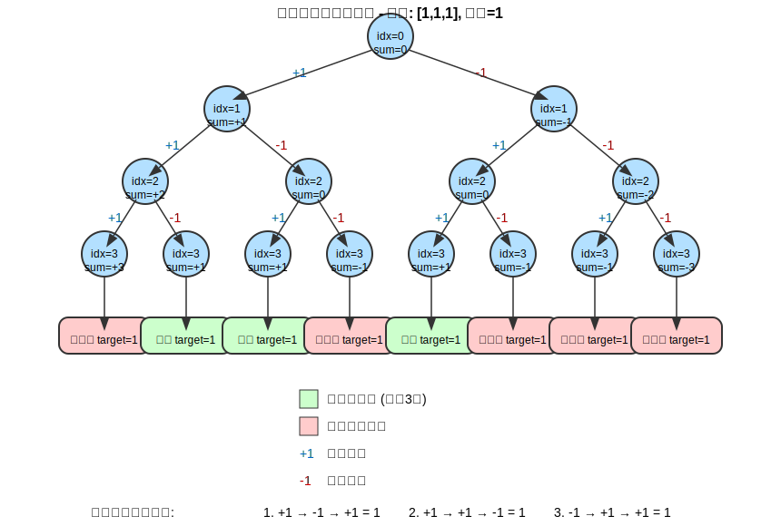

# 目标和

例题：[leetcode 494 目标和](https://leetcode.cn/problems/target-sum/description/)

## DFS 解法

原理如下图：



搜索树的左子树为"+"，右子树为"-"，依次 dfs 即可：

```cpp
class Solution
{
private:
    int _cnt = 0;
    // 参数：第idx个数字，目前的总和为sum
    void dfs(vector<int> &nums, int target, int idx, int sum)
    {
        if (idx == nums.size())
        {
            if (sum == target)
            {
                _cnt++;
            }
            return;
        }

        // 下一个数字使用“+”
        dfs(nums, target, idx + 1, sum + nums[idx]);
        // 下一个数字使用“-”
        dfs(nums, target, idx + 1, sum - nums[idx]);
    }

public:
    int findTargetSumWays(vector<int> &nums, int target)
    {
        dfs(nums, target, 0, 0);
        return _cnt;
    }
};
```

## DP 解法

这个问题可以巧妙地转化为 01 背包问题：

假设添加 "+" 的数字和为 P（Positive），添加 "-" 的数字和为 N（Negative）

- 我们知道 P + N = sum(nums)（所有数字的和）
- 同时 P - N = target（目标值）

联立这两个等式：

- P + N = sum
- P - N = target

解这个方程组：

- 2P = target + sum
- P = (target + sum) / 2

所以问题转化为：从数组中选取一些数字，使其和为 P = (target + sum) / 2

现在这就变成了一个经典的 01 背包问题：在 nums 数组中有多少种方式可以选择数字，使得它们的和恰好等于 (target + sum) / 2。

### 0 边界情况检查

1. 如果 |target| > sum，无解（因为即使给所有数字都添加同一符号，也无法达到目标值）
2. 如果 (target + sum) 是奇数，无解（因为 P 必须是整数）

### 1 定义 DP 数组

- `dp[j]`：表示和为 j，有 `dp[j]`种方法

### 2 初始化

- `dp[0] = 1`（表示装满容量为 0 的背包只有 1 种方法，即什么都不选）

### 3 递推公式

#### 二维 DP 状态转移方程推导

##### 状态定义

定义二维 DP 数组：

- `dp[i][j]` 表示：使用数组中前 `i` 个元素（即索引为 0 到 i-1 的元素），恰好凑成和为 `j` 的方法数。

##### 初始化分析

首先考虑一些基本情况：

- `dp[0][0] = 1`：表示使用 0 个元素，凑成和为 0 的方法数是 1（什么都不选）
- `dp[0][j] = 0` (j > 0)：表示使用 0 个元素，无法凑成和为 j (j > 0) 的组合

注意：如果 `nums` 中有 0，情况会有所不同，因为选或不选 0 都不影响总和。

##### 状态转移分析

现在考虑如何从已知状态推导未知状态。对于每个元素 `nums[i-1]`（注意索引偏移），我们有两种选择：

1. 不选 `nums[i-1]`：此时方法数等于 `dp[i-1][j]`
2. 选 `nums[i-1]`：此时方法数等于 `dp[i-1][j-nums[i-1]]`（前提是 `j ≥ nums[i-1]`）

因此，状态转移方程为：

如果 `j < nums[i-1]`：

```
dp[i][j] = dp[i-1][j]
```

如果 `j ≥ nums[i-1]`：

```
dp[i][j] = dp[i-1][j] + dp[i-1][j-nums[i-1]]
```

##### 具体推导过程举例

假设输入：`nums = [1, 1, 1]`, `target = 1`

1. 计算 `sum = 3`
2. 计算 `positive = (sum + target) / 2 = (3 + 1) / 2 = 2`

现在我们需要找出和为 2 的子集个数。

初始化 DP 数组：

```
dp[0][0] = 1
dp[0][j] = 0 (j > 0)
```

填充第一行（考虑元素 nums[0] = 1）：

- `dp[1][0] = dp[0][0] = 1`
- `dp[1][1] = dp[0][1] + dp[0][0] = 0 + 1 = 1`
- `dp[1][2] = dp[0][2] + dp[0][1] = 0 + 0 = 0`

填充第二行（考虑元素 nums[1] = 1）：

- `dp[2][0] = dp[1][0] = 1`
- `dp[2][1] = dp[1][1] + dp[1][0] = 1 + 1 = 2`
- `dp[2][2] = dp[1][2] + dp[1][1] = 0 + 1 = 1`

填充第三行（考虑元素 nums[2] = 1）：

- `dp[3][0] = dp[2][0] = 1`
- `dp[3][1] = dp[2][1] + dp[2][0] = 2 + 1 = 3`
- `dp[3][2] = dp[2][2] + dp[2][1] = 1 + 2 = 3`

最终答案是 `dp[3][2] = 3`，表示有 3 种方法使子集和为 2。

#### 从二维 DP 转化为一维 DP

##### 一维 DP 状态定义

定义一维 DP 数组：

- `dp[j]` 表示：当前考虑的元素集合中，恰好凑成和为 `j` 的方法数。

##### 状态转移方程推导

```
dp[i][j] = dp[i-1][j] + dp[i-1][j-nums[i-1]]
```

=> 压缩到一维：`dp[j] = dp[j] + dp[j-nums[i]]`

### 4 遍历顺序

- 外层循环遍历物品（数字）
- 内层循环遍历背包容量（从大到小）

```cpp
class Solution
{
public:
    int findTargetSumWays(vector<int> &nums, int target)
    {
        int sum = 0;
        for (int num : nums)
        {
            sum += num;
        }

        if (abs(target) > sum || (sum + target) % 2 == 1)
        {
            return 0;
        }

        int positive = (sum + target) / 2;

        vector<int> dp(positive + 1, 0);
        dp[0] = 1;

        for (int i = 0; i < nums.size(); i++)
        {
            for (int j = positive; j >= nums[i]; j--)
            {
                dp[j] += dp[j - nums[i]];
            }
        }

        return dp[positive];
    }
};
```
